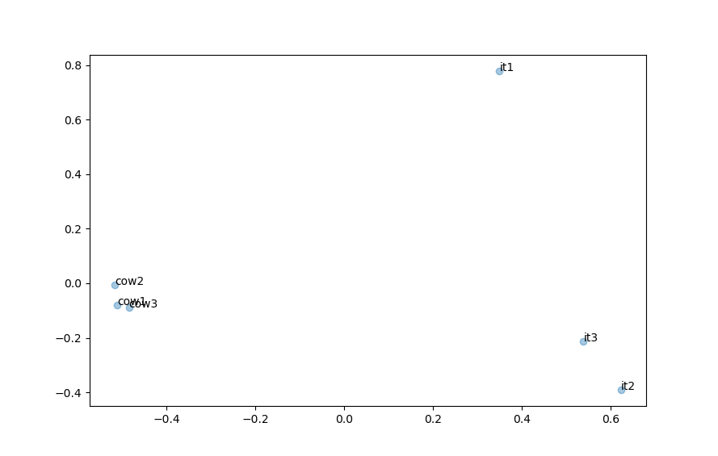

# neural_note_linking

Categorize bits of text by how similar they are using neural language models

## Dependencies

To install the required dependencies, you can use `pip`:
```bash
pip install -r requirements.txt
```

or nix:
```bash
nix-shell
```

In both cases, a model will be automatically downloaded on the first run.

## Usage example

```python
texts = [
    "I am a cow.",
    "My nature is that of a bovine.",
    "Je suis un animal qui donne du lait à ses veaux.",
    "Microprocessors are this company's specialty.",
    "Recent advances in quantum computing have been promising.",
    "La puissance des ordinateurs double tous les trois ans."
]

names = [
    "cow1",
    "cow2",
    "cow3",
    "it1",
    "it2",
    "it3"
]

dist = get_text_distances(texts, names)
print(dist.sort_values())
```

```
cow1  cow3    0.170995
      cow2    0.180422
cow2  cow3    0.196127
it2   it3     0.353634
it1   it3     0.411704
      it2     0.425816
cow2  it1     0.437633
cow3  it1     0.452270
cow1  it1     0.453539
cow3  it3     0.472382
cow2  it3     0.480014
cow1  it2     0.492905
      it3     0.494314
cow3  it2     0.496226
cow2  it2     0.516734
```

The algorithm correctly sorts the texts by similarity, grouping all 3 texts about cows together and
all 3 about IT together; and it does that across 2 different languages!

We can also generate a plot for the notes using the embeddings provided by the transformer.

```python
embed_and_plot(texts, names, sentence_transformer)
```



In this space, euclidean distance between the represented texts can be interpreted as semantic distance.


## Run on a [neuron](https://github.com/srid/neuron) zettelkasten

The `neuron.py` script looks through a [neuron](https://github.com/srid/neuron)
zettelkasten for notes that are semantically close but do not link to each
other. This can be used to suggest links that might not have been noticed yet.

Run it with:
```bash
python neuron.py path/to/zettelkasten
```
It requires `neuron` to be installed and in the `$PATH`. Tested with version `0.5.5.0`.

This is what the output looks like when run on the [neuron guide](https://neuron.zettel.page):
```
Zettel 1                                         │Zettel 2                                         │Score
─────────────────────────────────────────────────┼─────────────────────────────────────────────────┼───────
[2011404] Zettel Markdown                        │[2014401] MMark Limitations                      │0.14867
[2011502] Tutorial                               │[2013101] Examples                               │0.15234
[2011504] Linking                                │[2011506] Automatic links using queries          │0.18077
[2011402] Guide                                  │[2013101] Examples                               │0.18205
[2011402] Guide                                  │[6f0f0bcc] Philosophy                            │0.18399
[6f0f0bcc] Philosophy                            │[2011502] Tutorial                               │0.19298
[2012401] Declarative Install                    │[index] Neuron Zettelkasten                      │0.20085
[2012401] Declarative Install                    │[2013101] Examples                               │0.20153
[2013501] Searching your Zettelkasten            │[2011502] Tutorial                               │0.20164
[2011502] Tutorial                               │[2012401] Declarative Install                    │0.20210
[4a6b25f1] Editor integration                    │[index] Neuron Zettelkasten                      │0.21710
[2011501] Installing                             │[4a6b25f1] Editor integration                    │0.21740
[2011405] Web interface                          │[index] Neuron Zettelkasten                      │0.21770
...
```
